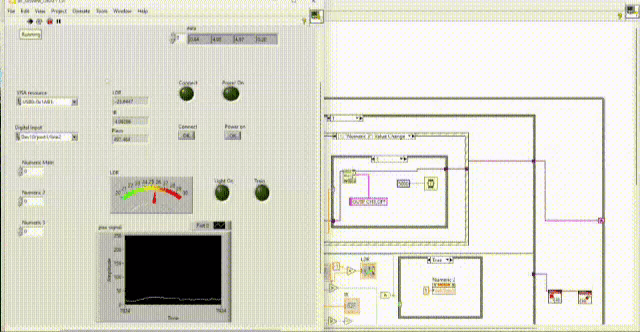

# Intelligent street lighting system with automated railway gate

The **Intelligent Street Lighting System with Automated Railway Gate** is a revolutionary project that optimizes energy consumption while enhancing road safety at railway crossings. The system utilizes three sensors: IR sensors, a custom train detection sensor, and light-dependent resistors (LDRs), along with two actuators—specifically, two servo motors.

During the day, the system detects trains in real-time and automatically opens or closes the railway gates as needed. At night, it detects both vehicles and trains, controlling the streetlights based on the presence of vehicles. This dual functionality maximizes energy efficiency by activating lights only when necessary.

The key benefits of the system include environmental sustainability, energy conservation, and improved safety at road-rail intersections. The primary objectives of the project are to enhance energy efficiency, ensure safety, and promote environmental sustainability, ultimately improving the overall quality of life in urban areas.

## Labview Screenshots

## Documentation

1.[Project proposal](https://github.com/lakshithagnk/Intelligent-street-lighting-system-with-automated-railway-gate/blob/7f1377ed28ba61c634a0d788b992cb2b3169ee58/media/Project_Proposal.pdf)

2.[Presentation](https://github.com/lakshithagnk/Intelligent-street-lighting-system-with-automated-railway-gate/blob/7f1377ed28ba61c634a0d788b992cb2b3169ee58/media/Intelligent%20Street%20Light%20System%20presentation.pptx)

## contributors

- [@lakshithagnk](https://github.com/lakshithagnk)
- [@Kavishka0220](https://github.com/Kavishka0220)
- [@............]
